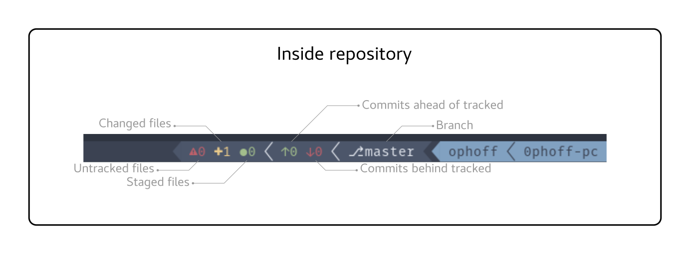

GITMUX
======
This tmux plugin sets some tmux environment variables with information about the current git repository.  
It is based of [tmux-gitbar](https://github.com/aurelien-rainone/tmux-gitbar), but gives the user more freedom to create his own statusbar with the variables.

## Installation
Install this plugin with [tpm](https://github.com/tmux-plugins/tpm).
  > set -g @plugin '0phoff/gitmux'

## Usage
### Tmux
In your tmux config, you can use the following variables
  - __GITMUX_SCRIPT__         : Path to the update script
  - __GITMUX_REPO__           : This value is non-zero if the current pane is in a git repository
  - __GITMUX_BRANCH__         : Name of the current branch
  - __GITMUX_REMOTE__         : Name of the tracking branch (0 if none)
  - __GITMUX_COMMITS_AHEAD__  : Number of commits the current branch is ahead of the remote tracking branch
  - __GITMUX_COMMITS_BEHIND__ : Number of commits the current branch is behind of the remote tracking branch
  - __GITMUX_STAGED__         : Number of files that are staged for the next commit
  - __GITMUX_CHANGED__        : Number of files that have changed since last commit (but not staged)
  - __GITMUX_UNTRACKED__      : Number of untracked files
  - __GITMUX_STASHED__        : Number of stashes
  - __GITMUX_CONFLICTS__      : Number of files with conflicts
  - __GITMUX_CLEAN__          : This value is 1 when there are no files untracked,changed or staged, no stashes and no conflicts

### Vim
If you want to update your statusbar whenever you save a file in Vim, add the following line to your vim config:
  > autocmd BufWritePost * silent! !eval $(tmux display -p "\#{GITMUX_SCRIPT}")

### Terminal
If you use the PROMPT_COMMAND variable in your terminal configuration, be sure to have it in this format:
  > PROMPT_COMMAND=" …your_functions_here… ;$PROMPT_COMMAND"

## Examples
Here is an example of how I use this plugin to show information on my status bar.
```tmux
# Shorted version, only important parts are shown
set -g status-right '#{?GITMUX_REPO,#[fg=red]#{GITMUX_UNTRACKED} #[fg=yellow]#{GITMUX_CHANGED} #[fg=green]●#{GITMUX_STAGED} #[fg=white] #[fg=green]↑#{GITMUX_COMMITS_AHEAD} #[fg=red]↓#{GITMUX_COMMITS_BEHIND} #[fg=white] ⎇ #{GITMUX_BRANCH} , }'

# Actual full version of the statusline I use
set -g status-right '#{?GITMUX_REPO,#[fg=brightblack]#[bg=black]#[fg=white]#[bg=brightblack] #[fg=red]#{GITMUX_UNTRACKED} #[fg=yellow]#{GITMUX_CHANGED} #[fg=green]●#{GITMUX_STAGED} #[fg=white] #[fg=green]↑#{GITMUX_COMMITS_AHEAD} #[fg=red]↓#{GITMUX_COMMITS_BEHIND} #[fg=white] #{?GITMUX_REMOTE,⎇ #{GITMUX_BRANCH},#[fg=red]⎇ #[fg=white]#{GITMUX_BRANCH}} #[fg=black], }#[fg=blue,bg=black]#[fg=black,bg=blue] #U  #H '
```


## Contributing
Please report bugs and file issues with possible improvements.  
If you used this plugin, feel free to share the code and a screenshot of it, so I can add it to the README.
